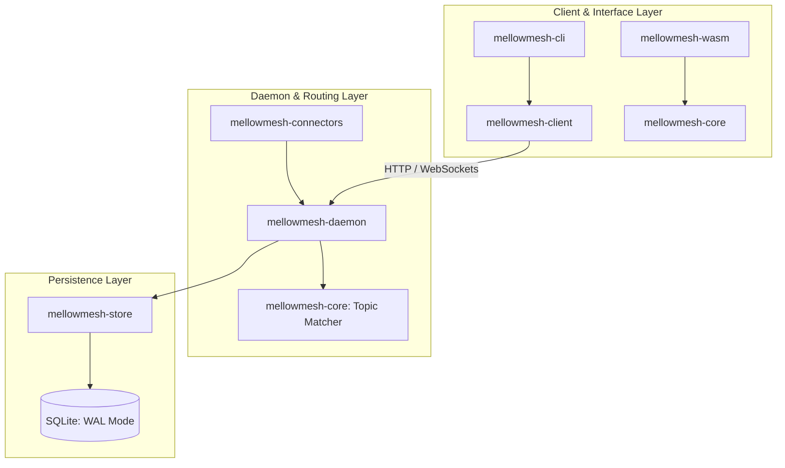

# MellowMesh System Architecture & Design

This document details the architectural design, core principles, system topology, data structures, and protocol specifications of MellowMesh.

---

## 1. Architectural Overview & Crate Topology

MellowMesh is implemented as a modular Rust Cargo workspace. The codebase is partitioned into distinct crates separating domain models, persistent storage, networking services, client tooling, and web runtimes:

### Crate Descriptions

1.  **[`mellowmesh-core`](file:///d:/development/mellowmesh/crates/mellowmesh-core)**:
    *   **Role**: Core domain logic and routing rules.
    *   **Key components**: Domain data structures (Topics, Tasks, Decisions, Agents, Artifacts) and the high-performance wild-card topic matching engine.
2.  **[`mellowmesh-store`](file:///d:/development/mellowmesh/crates/mellowmesh-store)**:
    *   **Role**: Database persistence layer.
    *   **Key components**: SQLite client with WAL (Write-Ahead Logging) mode, connection pooling via `r2d2`, migration logic, and entity-specific SQL repositories.
3.  **[`mellowmesh-daemon`](file:///d:/development/mellowmesh/crates/mellowmesh-daemon)**:
    *   **Role**: Background server (`mellowmeshd`).
    *   **Key components**: Axum HTTP routing, WebSocket pub/sub connection controllers, and the administration dashboard UI.
4.  **[`mellowmesh-client`](file:///d:/development/mellowmesh/crates/mellowmesh-client)**:
    *   **Role**: Software Development Kit (SDK) for third-party agents and clients.
    *   **Key components**: Async HTTP/WebSocket client wrappers and the auto-start daemon utility.
5.  **[`mellowmesh-cli`](file:///d:/development/mellowmesh/crates/mellowmesh-cli)**:
    *   **Role**: End-user terminal tool (`mellowmesh`).
    *   **Key components**: Command parsing (via `clap`), terminal formatting/table output, and the Model Context Protocol (MCP) server integration (`mellowmesh mcp`).
6.  **[`mellowmesh-connectors`](file:///d:/development/mellowmesh/crates/mellowmesh-connectors)**:
    *   **Role**: Third-party webhook handlers.
    *   **Key components**: Endpoints and HMAC authentication handlers for platforms like Microsoft Teams, Slack, and Discord.
7.  **[`mellowmesh-wasm`](file:///d:/development/mellowmesh/crates/mellowmesh-wasm)**:
    *   **Role**: Browser-native runtime.
    *   **Key components**: WebAssembly bindings for `mellowmesh-core` and Javascript client library wrappers to run MellowMesh entirely inside browser engines.

---

## 2. Core Design Principles

### Local-First & Decentralized
*   MellowMesh binds to `127.0.0.1` by default. It is designed to act as a personal, local-first intelligence bus.
*   Synchronization between separate user machines is achieved through message-passing relays or peer-to-peer topics rather than a single, centralized cloud server.

### Interface & Storage Independence
*   Work (tasks, logs, files, approvals) is represented by permanent database objects stored locally in SQLite, rather than being trapped in transitory chat histories (like Slack or Teams).
*   Any client interface can query or update the state of a task at any time.

### Structured Topic Pub/Sub
*   Messages are addressed using hierarchical topics (e.g., `work/coding/refactor`).
*   Subscribers utilize standard wildcards:
    *   `*`: Matches any single path segment (e.g., `work/*/refactor`).
    *   `**`: Matches any path segments recursively (e.g., `work/**`).

### Human-in-the-Loop Governance
*   Automated agents can subscribe to task topics and perform actions, but sensitive operations (such as running shell commands, editing source files, or initiating web requests) must publish a `Decision` object.
*   Execution halts until a human client reviews and explicitly authorizes the decision via the CLI or dashboard.

---

## 3. Core Data Schema (SQLite Persistence)

MellowMesh's state is persisted in SQLite using highly optimized queries in WAL mode:

### 3.1 Topics
*   Used for routing messages and syncing state.
*   Supports fast indexing for wildcard matches.

### 3.2 Messages
*   Fields: `id` (UUID), `topic` (TEXT), `sender` (TEXT), `payload` (JSON/TEXT), `timestamp` (DATETIME).
*   Messages represent the immutable event stream of the system.

### 3.3 Tasks
*   Fields: `id` (UUID), `title` (TEXT), `description` (TEXT), `status` (Enum: `Open`, `Claimed`, `Completed`, `Failed`), `assigned_agent` (TEXT), `created_at` (DATETIME), `updated_at` (DATETIME).

### 3.4 Decisions
*   Fields: `id` (UUID), `task_id` (UUID), `proposer` (TEXT), `action_type` (TEXT), `payload` (JSON), `status` (Enum: `Pending`, `Approved`, `Rejected`), `approved_by` (TEXT), `timestamp` (DATETIME).

### 3.5 Named Topics
*   Fields: `name` (TEXT PRIMARY KEY), `topic` (TEXT).
*   Maps human-friendly short names (e.g. `Mario Galaxy` or `General`) to standard topic paths (e.g. `_forum.games.mario galaxy` or `_forum.general`).
*   Distributed across peered daemons via P2P synchronization on system topics (`_system.registry.named_topic`).

---

## 4. Visual Identity & Brand System

MellowMesh features a clean, high-tech, glassmorphic visual system designed to fit developer tools and modern workspaces. 

For full specifications on color palettes, typography, UI components, and the official logo, refer to the [MellowMesh Brand Kit](file:///d:/development/mellowmesh/branding/brand_kit.md).
