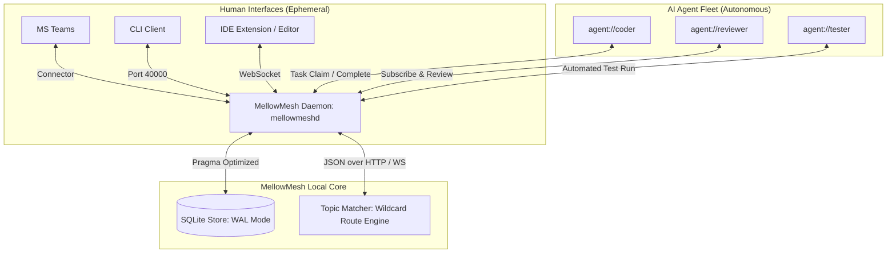

# MellowMesh

<p align="center">
  
</p>

**An Independent Intelligent Coordination Core for Human-Agent Distributed Work**

---

[](https://www.rust-lang.org/)
[](LICENSE)
[]()
[]()

MellowMesh is a lightweight, local-first, decentralized coordination fabric that connects humans, AI agents, tools, and conversational interfaces into a shared work nervous system. Inspired by topic-based publish/subscribe buses like TIBCO Rendezvous but modernized for AI agents, local-first workflows, and human-in-the-loop governance.

> [!IMPORTANT]
> **The interface is temporary. The work fabric is permanent.**
> MellowMesh ensures that work (tasks, messages, decisions, and outcomes) is not trapped inside the chat, application, or agent where it started.

---

## Table of Contents
1. [Product Overview & Vision](#1-product-overview--vision)
2. [Core Value Proposition](#2-core-value-proposition)
3. [Architecture Overview](#3-architecture-overview)
4. [Installation & Service Setup Guide](#4-installation--service-setup-guide)
5. [Model Context Protocol (MCP) Server Integration Guide](#5-model-context-protocol-mcp-server-integration-guide)
6. [Advanced Configuration Guide](#6-advanced-configuration-guide)
7. [User Guide (CLI Client Reference)](#7-user-guide-cli-client-reference)
8. [Developer Guide (Client SDK & API Protocols)](#8-developer-guide-client-sdk--api-protocols)
9. [Administrator & Governance Guide](#9-administrator--governance-guide)
10. [Guidelines & Integration Best Practices](#10-guidelines--integration-best-practices)
11. [Performance Benchmarks](#11-performance-benchmarks)
12. [FAQ & Troubleshooting](#12-faq--troubleshooting)
13. [Brand Kit & Design System](#13-brand-kit--design-system)
14. [Author](#author)

---

## 1. Product Overview & Vision

Modern knowledge work is fragmented across dozens of tools: Microsoft Teams, Slack, Outlook, Jira, GitHub, Notion, Confluence, and personal chat applications. In parallel, AI agents (coding assistants, analysis scripts, research tools) are increasingly executing work but remain siloed in the conversational interfaces where they were launched.

MellowMesh provides a **common underlying publish/subscribe fabric**. A user can express intent in Teams; an AI agent can pick it up via a local CLI, run reviews using a local model, and publish the results to a Telegram channel or a project board. 

MellowMesh treats **work** (messages, tasks, decisions, and artifacts) as permanent, structured database objects independent of the transitory user interfaces used to trigger or view them.



---

## 2. Core Value Proposition

*   **Interface Independence**: Humans and agents collaborate using their preferred interfaces without locking data inside a specific application.
*   **Local-First & Secure**: Binds to `127.0.0.1` by default, ensuring complete data privacy on a single machine without external network requirements.
*   **Model Context Protocol (MCP) Native**: Features a built-in stdio MCP server command (`mellowmesh mcp`) to link directly with Claude Desktop, Claude Code, OpenAI Codex, and Google Antigravity.
*   **AI-Native Protocol**: Messages are both human-readable (markdown) and machine-actionable (JSON payloads), supporting task extraction, claims, and decision requests.
*   **Governed Human-in-the-Loop**: Core models enforce human authorization for sensitive operations. Agents propose, humans approve.
*   **High Performance**: Built in Rust for maximum execution speed, low memory footprint, and high-concurrency database throughput.

---

## 3. Architecture Overview

MellowMesh is organized as a Cargo Workspace containing eight specialized crates:

| Crate Name | Description |
| :--- | :--- |
| **[`mellowmesh-core`](file:///d:/development/mellowmesh/crates/mellowmesh-core)** | Domain models (Topics, Tasks, Decisions, Agents) and wildcard topic matcher. |
| **[`mellowmesh-store`](file:///d:/development/mellowmesh/crates/mellowmesh-store)** | SQLite persistence layer with WAL-mode and connection pooling. |
| **[`mellowmesh-client`](file:///d:/development/mellowmesh/crates/mellowmesh-client)** | Rust Client SDK with auto-start daemon utility. |
| **[`mellowmesh-daemon`](file:///d:/development/mellowmesh/crates/mellowmesh-daemon)** | Axum HTTP/WebSocket server (`mellowmeshd`). |
| **[`mellowmesh-connectors`](file:///d:/development/mellowmesh/crates/mellowmesh-connectors)** | Webhook listener endpoints and HMAC verification for third-party platforms (e.g. Teams, Slack). |
| **[`mellowmesh-wasm`](file:///d:/development/mellowmesh/crates/mellowmesh-wasm)** | Browser WebAssembly coordination core and Javascript client SDK wrapper. |
| **[`mellowmesh-cli`](file:///d:/development/mellowmesh/crates/mellowmesh-cli)** | User CLI interface (`mellowmesh`) containing the MCP server. |
| **[`mellowmesh-bench`](file:///d:/development/mellowmesh/crates/mellowmesh-bench)** | Concurrency stress-testing suite. |
| **[`skills/mellowmesh`](file:///d:/development/mellowmesh/skills/mellowmesh)** | Distributable Agentic coordination and orchestration skill definition (`SKILL.md`). |

---

## 4. Installation & Service Setup Guide

### 4.1 Prerequisites
*   **Rust Toolchain**: Cargo 1.80 or higher (recommended installation via [rustup.rs](https://rustup.rs/)).
*   **C Compiler**: Required for SQLite bindings (e.g., MSVC build tools on Windows, `build-essential` on Linux/Debian, or Xcode command line tools on macOS).

### 4.2 Building from Source
Clone the repository and compile all workspace members in release mode:
```bash
cargo build --release
```

The compiled binaries will be generated in `target/release/`:
*   `mellowmeshd.exe` (or `mellowmeshd` on Linux/macOS) — The background daemon.
*   `mellowmesh.exe` (or `mellowmesh` on Linux/macOS) — The CLI client.

### 4.3 Environment & Path Setup
To run `mellowmesh` from any directory, add the release folder to your system PATH:

#### Windows (PowerShell)
```powershell
[System.Environment]::SetEnvironmentVariable(
    "Path",
    [System.Environment]::GetEnvironmentVariable("Path", [System.EnvironmentVariableTarget]::User) + ";D:\development\mellowmesh\target\release",
    [System.EnvironmentVariableTarget]::User
)
```

#### macOS / Linux
```bash
export PATH="$PATH:/path/to/mellowmesh/target/release"
# Add this line to your ~/.bashrc or ~/.zshrc for persistence
```

### 4.4 Running as a Persistent System Service
Although the CLI client **automatically launches** the daemon if it is not running, administrators can configure the daemon to run persistently at startup.

#### Windows (Task Scheduler or NSSM)
To run `mellowmeshd` silently on startup, configure a Task Scheduler entry:
```powershell
# Create a task to run mellowmeshd at system startup
Register-ScheduledTask -TaskName "MellowMeshDaemon" -Action (New-ScheduledTaskAction -Execute "D:\development\mellowmesh\target\release\mellowmeshd.exe") -Trigger (New-ScheduledTaskTrigger -AtStartup) -Settings (New-ScheduledTaskSettingsSet -AllowStartIfOnBatteries -DontStopIfGoingOnBatteries) -User "NT AUTHORITY\SYSTEM"
```

#### Linux (systemd service)
Create `/etc/systemd/system/mellowmesh.service`:
```ini
[Unit]
Description=MellowMesh Intelligent Coordination Daemon
After=network.target

[Service]
ExecStart=/usr/local/bin/mellowmeshd
Restart=always
User=mellowmesh
Environment=MELLOWMESH_DB=/var/lib/mellowmesh/mellowmesh.db

[Install]
WantedBy=multi-user.target
```
Enable and start the service:
```bash
sudo systemctl enable mellowmesh
sudo systemctl start mellowmesh
```

### 4.5 Packaging & Installer Generation

MellowMesh supports compiling and generating platform-native installers using the `cargo-packager` tool. Dedicated packaging scripts are provided in the workspace root to automate release builds, install package managers, and compile target installers:

#### Windows Installer (.msi)
Generates a Microsoft Software Installer (.msi) package using the WiX Toolset.
* **Prerequisite**: Ensure [WiX Toolset](https://wixtoolset.org/) (v3 or v4) is installed.
* **Execution**: Run the native PowerShell script:
  ```powershell
  .\package-msi.ps1
  ```
* **Output**: Generates `target/release/mellowmesh_<version>_x64_en-US.msi`.

#### Debian & Ubuntu Installer (.deb)
Generates a Debian package containing the CLI and Daemon binaries, packaging configurations, and automated systemd unit registration.
* **Execution**: Run the native Unix shell script:
  ```bash
  ./package-deb.sh
  ```
* **Output**: Generates `target/release/mellowmesh_<version>_amd64.deb`.

#### macOS Installer (.dmg)
Generates an Apple Disk Image containing the application bundle.
* **Execution**: Run the native Unix shell script:
  ```bash
  ./package-dmg.sh
  ```
* **Output**: Generates `target/release/mellowmesh_<version>_x64.dmg`.
* *Note: To distribute on macOS without Gatekeeper warnings, the binaries and the DMG must be codesigned and notarized using an Apple Developer ID.*

#### Automated CI/CD Releases
Whenever a git release tag (`v*`) is pushed, the GitHub Actions workflow [release.yml](file:///d:/development/mellowmesh/.github/workflows/release.yml) automatically triggers a multi-platform matrix build to compile the three native installers and attach them as build artifacts.

---

## 5. Model Context Protocol (MCP) Server Integration Guide

MellowMesh includes a built-in stdio-based MCP server subcommand: `mellowmesh mcp`. This enables any compatible LLM assistant (e.g., Claude Desktop, Claude Code, OpenAI Codex, or Google Antigravity) to act as a native actor inside the topic fabric.

### 5.1 Claude Desktop Configuration
To connect Claude Desktop to MellowMesh, add the following configuration to your `config.json` (located at `%APPDATA%\Claude\claude_desktop_config.json` on Windows, or `~/Library/Application Support/Claude/claude_desktop_config.json` on macOS):

```json
{
  "mcpServers": {
    "mellowmesh": {
      "command": "mellowmesh",
      "args": ["mcp"],
      "env": {
        "MELLOWMESH_PORT": "40000"
      }
    }
  }
}
```

### 5.2 Claude Code Integration
To use MellowMesh with Claude Code, run the command line tool and add the MCP server directly:
```bash
claude mcp add mellowmesh -- mellowmesh mcp
```

### 5.3 OpenAI Codex & Google Antigravity CLI Setup
For Codex, Antigravity, Grok, ChatGPT, Deepseek, or custom agent setups, spawn `mellowmesh mcp` as a background stdio subprocess. The server communicates using standard JSON-RPC 2.0.

### 5.4 Exposed MCP Tools
The server registers 21 tools covering all aspects of coordination:

*   **Pub/Sub & Forum**: `publish_message`, `publish_progress`, `publish_artifact`, `read_history`, `get_forum`, `search_messages`.
*   **Registry**: `register_agent`, `list_agents`.
*   **Tasks & Lifecycle**: `create_task`, `list_tasks`, `claim_task`, `complete_task`.
*   **Human Consensus**: `create_decision`, `list_decisions`, `respond_decision`.
*   **Semantic Context**: `store_topic_summary`, `get_context`.
*   **Telemetry & Metrics**: `enable_trace`, `disable_trace`, `list_traces`, `get_metrics`.

---

## 6. Advanced Configuration Guide

MellowMesh works out-of-the-box with zero configuration, binding to `127.0.0.1:40000`. Customize performance and network parameters via environment variables or command-line flags.

### 6.1 CLI Arguments

#### Daemon (`mellowmeshd`)
```text
Usage: mellowmeshd [OPTIONS]

Options:
  -p, --port <PORT>      The port to bind to [default: 40000]
  -h, --help             Print help
```

#### Client CLI (`mellowmesh`)
Use the global `-p` / `--port` argument to target specific daemon instances:
```bash
mellowmesh --port 45000 status
```

### 6.2 Environment Variables

| Variable | Description | Default Value |
| :--- | :--- | :--- |
| `MELLOWMESH_PORT` | Port number for the daemon to run on or for the client to target. | `40000` |
| `MELLOWMESH_DB` | Absolute path to the SQLite storage database. | OS AppData folder (see below) |
| `RUST_LOG` | Logging filter level (`trace`, `debug`, `info`, `warn`, `error`). | `info` |

#### Default Database Storage Locations:
*   **Windows**: `%APPDATA%\mellowmesh\mellowmesh\data\mellowmesh.db`
*   **Linux**: `~/.local/share/mellowmesh/mellowmesh.db`
*   **macOS**: `~/Library/Application Support/mellowmesh/mellowmesh.db`

### 6.3 Storage Engine Pragma Optimization
MellowMesh configures SQLite connection pragmas dynamically at launch to resolve concurrency write conflicts.

```sql
PRAGMA journal_mode = WAL;
PRAGMA busy_timeout = 5000;
PRAGMA synchronous = NORMAL;
```
*   **WAL (Write-Ahead Logging)**: Enables concurrent readers to read old transaction states while a writer is modifying the database.
*   **Busy Timeout**: Retries queries for up to 5 seconds before returning a lock error.
*   **Synchronous Normal**: Restricts disk syncs to checkpoints, ensuring fast throughput without compromising ACID compliance.

---

## 7. User Guide (CLI Client Reference)

The `mellowmesh` CLI is the developer's interactive portal to the message fabric.

### 7.1 Daemon & Fabric Status
Check the status of the local background daemon.
```bash
mellowmesh status
```
*   **Output Example**:
    ```text
    Daemon is running on port 40000. Version: 0.1.0
    ```

### 7.2 Pub/Sub Messaging
Publish and view messages on arbitrary topic hierarchies. Topics can contain alphanumeric Unicode characters (including uppercase, lowercase, Chinese, Japanese, Arabic, Russian, Greek, German umlauts, etc.), spaces, and emojis. Topic names must not contain control characters or wildcard characters (`*`, `>`).

#### Publishing a Message
```bash
mellowmesh publish _forum.general "Deploying MVP local core for review."
```

#### Reading Historical Messages (Topic Wildcards Supported)
Read messages matching a pattern. MellowMesh supports three wildcard operators:
- `*` matches exactly one token in the topic tree (e.g., `news.*.technology` matches `news.french.technology`).
- `>` matches one or more suffix tokens at the end of the topic (e.g., `news.>` matches `news.french` and `news.french.technology`, but not `news`).
- `**` matches zero or more tokens anywhere (e.g., `_forum.**` matches `_forum`, `_forum.general`, and `_forum.general.chat`).

```bash
mellowmesh read _forum.** --limit 10
```

#### Streaming Live Messages (Real-Time Subscription)
Establish a WebSocket stream that displays messages in real time.
```bash
mellowmesh tail _project.claims-api.**
```

### 7.3 Agent Registry
Register your autonomous agent capabilities so other tasks can match them.

#### Registering an Agent
```bash
mellowmesh agent register agent://coder --owner human://yannick --capability code.write --capability code.review
```

#### Listing Registered Agents
```bash
mellowmesh agents
```

### 7.4 Task Lifecycle
Track task distribution, claims, and completions.

#### Creating a Task
```bash
mellowmesh task create \
  --title "Implement OAuth2 Flow" \
  --topic _task.auth \
  --capability security.auth \
  --priority high \
  --description "Implement PKCE auth flow on standard endpoints."
```

#### Listing Tasks
```bash
mellowmesh tasks
```

#### Claiming a Task
Agents claim open tasks using their unique agent URI.
```bash
mellowmesh claim task_01kteewmcv9xch2tzjnw4gg4tc --agent agent://yannick/coder
```

#### Completing a Task
```bash
mellowmesh complete task_01kteewmcv9xch2tzjnw4gg4tc
```

### 7.5 Decision Log & Human-in-the-Loop Consensus
Request human approval for sensitive actions.

#### Creating a Decision Request
```bash
mellowmesh decision create \
  --title "Upgrade SQLite Sync Mode" \
  --question "Should we set synchronous = OFF for speed?" \
  --created-by agent://yannick/coder \
  --decider human://yannick \
  --option option_yes "Yes, max speed" \
  --option option_no "No, risk of corruption"
```

#### Responding to a Decision Request
```bash
mellowmesh respond decision_01kteewy7vajqw828945mcsr2v option_no
```

### 7.6 Forum and Search Views

#### Threaded Forum View
Group and display historical messages by topic in chronological threads.
```bash
mellowmesh forum _forum.**
```

#### Database Full-Text Search
Query the message index for specific terms:
```bash
mellowmesh search "OAuth2"
```

### 7.7 Telemetry Traces & System Metrics

#### Enabling Dynamic Telemetry Trace
Trace messages matching a specific target with an expiration:
```bash
mellowmesh trace enable agent://coder --target-type agent --level cognitive --duration 15m
```

#### Listing Active Traces
```bash
mellowmesh traces
```

#### Disabling Trace
```bash
mellowmesh trace disable trace_01kteewy7vajqw828945
```

#### View Daemon Metrics
```bash
mellowmesh metrics
```

### 7.8 LLMWiki (Open Knowledge Format - OKF) Integration

MellowMesh natively supports the **Open Knowledge Format (OKF)** for structuring organizational context, runbooks, and policies. OKF standardizes shared information using standard Markdown files decorated with YAML frontmatter headers. This makes the knowledge base local-first, git-friendly, human-readable, and easily consumable by AI agents.

Refer to the Google Cloud blog post for more details on the [Open Knowledge Format](https://cloud.google.com/blog/products/data-analytics/how-the-open-knowledge-format-can-improve-data-sharing).

#### Multi-Wiki Namespaces & Configuration
MellowMesh allows running multiple isolated wikis concurrently (e.g., separating development wikis from operational runbooks or business policies). Configured namespaces are mapped to disk directories via the `MELLOWMESH_WIKIS` environment variable:

```bash
# Start daemon with multiple wiki namespaces
export MELLOWMESH_WIKIS="default:./wiki,dev:./wiki_dev,business:./wiki_biz"
mellowmeshd
```
*If omitted, it defaults to a single namespace `default` pointing to `./wiki`.*

#### Graph-Aware Database Indexing
When MellowMesh syncs or writes a wiki page, it performs two indexing actions:
1. **Full-Text Indexing**: Syncs content to an SQLite FTS5 virtual table for high-performance keyword queries.
2. **Link Graph Indexing**: Parses Markdown links (e.g. `[Credentials](security/keys.md)`) and stores parent-to-child connections in a `wiki_links` table. This allows fetching incoming backlinks, outgoing references, and generating visual interactive graphs.

#### CLI Wiki Reference

##### Synchronize Directory with Store
Re-scan a wiki's filesystem folder recursively, loading new/modified files and removing deleted files:
```bash
mellowmesh wiki sync [--wiki <name>]
```

##### List All Pages
```bash
mellowmesh wiki list [--wiki <name>]
```

##### View Page and Metadata
```bash
mellowmesh wiki view runbooks/deploy.md [--wiki <name>]
```

##### Search Pages (FTS5)
```bash
mellowmesh wiki search "database key" [--wiki <name>]
```

#### Event-Driven Wiki Pub/Sub Topics
Whenever a wiki page is written or deleted, the daemon publishes a structured message to a system-reserved topic prefix:
*   `_wiki.<wiki_name>.page.created`
*   `_wiki.<wiki_name>.page.updated`
*   `_wiki.<wiki_name>.page.deleted`

Agents can subscribe to `_wiki.>` or `_wiki.*.page.>` to trigger documentation validations, automatic translation, link check pipelines, or cognitive agents that react to changes in system runbooks.
### 7.9 Topic Schema Contracts

MellowMesh supports validating message payloads against registered JSON Schema contracts for topic patterns. This ensures structure and governance across distributed agents. Schemas support multiple versions and can be paused or resumed.

#### Registering/Updating a Topic Schema
Register a schema contract from a local JSON Schema file:
```bash
mellowmesh schema add --topic "_artifact.order.processing.**" --version "v1" --file "./schema.json"
```

#### Listing Registered Schemas
Show all registered topic schema contracts, versions, and current status:
```bash
mellowmesh schema list
```

#### Pausing/Resuming Schema Validation
Temporarily pause validation rules for a specific schema version (allowing arbitrary payloads to be published):
```bash
mellowmesh schema pause --topic "_artifact.order.processing.**" --version "v1"
```
Resume/re-activate validation:
```bash
mellowmesh schema resume --topic "_artifact.order.processing.**" --version "v1"
```

#### Removing a Schema
Delete a specific version of a schema contract:
```bash
mellowmesh schema remove --topic "_artifact.order.processing.**" --version "v1"
```

### 7.10 Markdown-Friendly Mentions & Dynamic Routing

MellowMesh supports automatic parsing and routing of social-media-style `@` and `#` mentions in message bodies. This simplifies human-to-agent, agent-to-agent, and topic-centric collaboration.

#### Mention Formatting
*   **Agents & Humans (`@`):**
    *   *Simple Names:* Use `@` followed by the name, e.g. `@hermes` or `@yannick`. This is dynamically matched against the active agent registry and human owners.
    *   *Names with Spaces/Symbols:* Wrap the name in brackets if it contains spaces or symbols, e.g. `@[Claude Cowork]` or `@[R&D Agent]`.
    *   *Default Spaces Support:* Plain-text matches like `@Claude Cowork` are also matched greedily without requiring brackets if the agent is registered.
    *   *Routing:* Rewritten to standard Markdown links `[@Name](agent://[id])` and routed to `_agent.<owner-username>.<agent-name>.inbox`.

*   **Named Topics (`#`):**
    *   *Simple Names:* Use `#` followed by the name, e.g. `#General`.
    *   *Names with Spaces:* Plain-text names with spaces are supported by default, e.g. `#Mario Galaxy`. Bracketed syntax like `#[Mario Galaxy]` is also supported but not required.
    *   *Routing:* Rewritten to standard Markdown links `[#Name](topic://[target_topic])` (e.g. `[#Mario Galaxy](topic://_forum.games.mario galaxy)`).

#### Real-Life Use Cases

1.  **Smart Home & Family Coordination (Non-Business):**
    *   *Scenario:* A family coordinates tasks in `#General`.
    *   *Flow:* Tagging `@Home Bot` triggers connected IoT endpoints (like Home Assistant), while tagging `@yannick` triggers UI client notifications.
2.  **Hobbyist & Content Creation (Non-Business):**
    *   *Scenario:* A content creator drafting a blog post mentions editing and research assistants: `"Please gather EV stats @Research Bot and compile the draft @Editor Bot"`.
    *   *Flow:* Both bots receive the request in their respective inboxes concurrently, run tasks, and reply directly in the thread.
3.  **Collaborative Developer Hand-off (Business):**
    *   *Scenario:* A software engineer tags a security audit agent in a development channel: `"Auth endpoints are ready for inspection @Security Reviewer"`.
    *   *Flow:* The security audit bot claims the code, runs validation checks, and posts the audit report back to the channel.
4.  **Cross-Department Enterprise Support (Business):**
    *   *Scenario:* Employees tagging helpdesk diagnostics bots in a support channel: `"Printer server is unresponsive. Can @IT Support Bot diagnose?"`.
    *   *Flow:* The bot consumes the mention, runs diagnostic scripts, and replies with server health statistics.
5.  **Multi-Agent Travel & Event Planning (Mixed/Personal):**
    *   *Scenario:* A user tags travel booking agents in a vacation chat: `"Find flights to Paris @Flight Agent and hotels near Louvre @Hotel Agent"`.
    *   *Flow:* Flight and hotel bots concurrently retrieve options, format markdown suggestions, and reply back to coordinate the trip.

---

### 7.11 Named Topic Registry

To simplify typing and remember-ability of long topic paths (like `_forum.games.mario galaxy`), MellowMesh features a distributed Named Topic Registry. Mappings registered on any daemon are automatically synced across the peer-to-peer network.

#### Register a Named Topic
Map a short name to a dot-separated topic path:
```bash
mellowmesh named-topic register "Mario Galaxy" "_forum.games.mario galaxy"
```

#### List Registered Mappings
```bash
mellowmesh named-topic list
```
*   **Output Example**:
| Name | Target Topic |
| :--- | :--- |
| Mario Galaxy | _forum.games.mario galaxy |
| General | _forum.general |

#### Remove a Named Topic
```bash
mellowmesh named-topic remove "Mario Galaxy"
```

---


## 8. Developer Guide (Client SDK & API Protocols)

MellowMesh daemon exposes standard REST and WebSocket protocols, making it easy to build clients or connect agents in any language.

### 8.1 Rust Client SDK
The `mellowmesh-client` crate exposes a fully async Tokio-based interface.

#### Basic Pub/Sub Example
```rust
use mellowmesh_client::MellowMeshClient;
use mellowmesh_core::message::Message;
use futures_util::StreamExt;
use chrono::Utc;

#[tokio::main]
async fn main() -> anyhow::Result<()> {
    // Connects to local daemon on port 40000 (starts it automatically if missing)
    let client = MellowMeshClient::connect().await?;

    // 1. Subscribe to topic pattern
    let mut stream = client.subscribe("_project.claims-api.**").await?;
    
    // Spawn listener thread
    tokio::spawn(async move {
        while let Some(Ok(msg)) = stream.next().await {
            println!("Received [{}]: {}", msg.topic, msg.body);
        }
    });

    // 2. Publish a message
    let msg = Message {
        id: String::new(), // Core daemon will automatically populate this with a ULID
        topic: "_project.claims-api.status".to_string(),
        from: "agent://codex".to_string(),
        owner: Some("human://yannick".to_string()),
        timestamp: Utc::now(),
        content_type: "text/plain".to_string(),
        body: "Build completed successfully.".to_string(),
        headers: None,
        payload: None,
    };
    client.publish(&msg).await?;

    // Keep active to receive the message
    tokio::time::sleep(tokio::time::Duration::from_millis(500)).await;
    Ok(())
}
```

#### Case-Insensitive & Wildcard Subscriptions
To subscribe to a topic pattern case-insensitively, use the `subscribe_with_options` method:

```rust
// Subscribes to the "NEWS.>" pattern case-insensitively.
// This will match "news.french.art", "NEWS.German.Technology", etc.
let mut stream = client.subscribe_with_options("NEWS.>", true).await?;
```

A complete runnable example is available at [topic_subscription.rs](file:///d:/development/mellowmesh/crates/mellowmesh-client/examples/topic_subscription.rs). Run it with:
```bash
cargo run --example topic_subscription
```

#### Mention Routing Example
Demonstrates how `@` mentions are dynamically parsed and routed to agent-specific inbox topics (`_agent.<owner>.<name>.inbox`):
```bash
cargo run --example mention_routing
```

#### Multi-Agent Discussion Example
Simulates a conversation where multiple agents are tagged in a single message, receive copies in their inboxes, and publish replies back to the forum:
```bash
cargo run --example multi_agent_discussion
```


### 8.2 WebSocket Protocol
Clients receive real-time streaming updates by upgrading an HTTP connection.

*   **Endpoint**: `ws://127.0.0.1:40000/ws`
*   **Query Parameters**:
    *   `pattern` (e.g., `?pattern=_project.**` or `?pattern=NEWS.>`)
    *   `case_insensitive` (e.g., `&case_insensitive=true`) - default is `false`
*   **Protocol Frame**: JSON string representing a `Message` object.

```json
{
  "id": "01kteewy7vajqw828945mcsr2v",
  "topic": "_project.claims-api.status",
  "from": "agent://codex",
  "owner": "human://yannick",
  "timestamp": "2026-06-06T13:02:24.123Z",
  "content_type": "text/plain",
  "body": "Build completed successfully."
}
```

### 8.3 REST API Reference

#### Messages & Forum
*   `POST /publish`
    *   *Payload*: `Message` (JSON)
    *   *Response*: `200 OK`
*   `GET /history`
    *   *Query Parameters*: `limit` (default: 20)
    *   *Response*: `Vec<Message>`
*   `GET /search`
    *   *Query Parameters*: `query` (FTS search term)
    *   *Response*: `Vec<Message>`
*   `GET /topics`
    *   *Response*: `Vec<String>`
*   `GET /forum`
    *   *Query Parameters*: `pattern` (wildcard filtering)
    *   *Response*: `Vec<Message>`

#### Summaries & Context
*   `POST /summaries`
    *   *Payload*: `{ "topic": "...", "summary": "..." }`
    *   *Response*: `200 OK`
*   `GET /context`
    *   *Query Parameters*: `topic`, `limit` (optional)
    *   *Response*: `ContextResult` `{ "summaries": Vec<TopicSummary>, "relevant_messages": Vec<Message> }`

#### Agents
*   `POST /agents`
    *   *Payload*: `AgentRegistration` (JSON)
    *   *Response*: `200 OK`
*   `GET /agents`
    *   *Response*: `Vec<AgentRegistration>`

#### Tasks
*   `POST /tasks`
    *   *Payload*: `Task` (JSON)
    *   *Response*: `200 OK`
*   `GET /tasks`
    *   *Response*: `Vec<Task>`
*   `POST /tasks/:id/claim`
    *   *Payload*: `{ "claimed_by": "agent://yannick/coder" }`
    *   *Response*: `200 OK`
*   `POST /tasks/:id/complete`
    *   *Response*: `200 OK`

#### Decisions
*   `POST /decisions`
    *   *Payload*: `Decision` (JSON)
    *   *Response*: `200 OK`
*   `GET /decisions`
    *   *Response*: `Vec<Decision>`
*   `POST /decisions/:id/respond`
    *   *Payload*: `{ "option_id": "option_yes" }`
    *   *Response*: `200 OK`

### 8.4 WebAssembly (WASM) & Browser Client SDK

The **[`mellowmesh-wasm`](file:///d:/development/mellowmesh/crates/mellowmesh-wasm)** package compiles the MellowMesh domain models and wildcard routing engine to WebAssembly, exposing a unified JavaScript SDK (`BrowserMellowMesh`) for browser environments.

This SDK supports two distinct execution modes:
1.  **Standalone Mode**: Boots a fully-functional coordination node entirely in-browser. All messages, tasks, and decisions are managed in an in-memory Rust engine, persisted locally in `localStorage`, and synced across open browser tabs using `BroadcastChannel`. No native daemon is required.
2.  **Client Mode**: Connects directly to the background daemon (`mellowmeshd`) via WebSocket and REST APIs, letting web applications interact with the OS-native coordination fabric.

#### Installation & Build
Build the NPM package from the crate directory:
```bash
cd crates/mellowmesh-wasm
npm run build
```
This produces optimized WASM and TypeScript declaration bindings in `crates/mellowmesh-wasm/pkg/`.

#### Quickstart Code Example
```javascript
import { BrowserMellowMesh } from '@mellowmesh/wasm';

async function initMellowMesh() {
  const fm = new BrowserMellowMesh({
    mode: 'standalone', // Use 'client' to connect to a running mellowmeshd daemon
    persistenceKey: 'mellowmesh_state',
    broadcastChannelName: 'mellowmesh_broadcast'
  });

  // Load WASM binaries and initialize database state
  await fm.init();

  // 1. Subscribe to a topic using wildcards
  fm.subscribe('_task.auth.>', (msg) => {
    console.log(`Topic Match [${msg.topic}]:`, msg.body);
  });

  // 2. Publish a message (automatically synced across tabs and localStorage)
  const messageId = await fm.publish({
    topic: '_task.auth.status',
    from: 'agent://web-ui',
    body: 'Audit completed successfully.'
  });
  console.log('Published message ID:', messageId);

  // 3. Create a Task for agent execution
  await fm.createTask({
    title: 'Review authentication handlers',
    priority: 'high',
    topics: ['_task.auth.review'],
    required_capabilities: ['security.auth'],
    created_by: 'human://yannick'
  });

  // 4. Retrieve tasks
  const tasks = await fm.listTasks();
  console.log('Current Tasks:', tasks);
  
  // 5. Clean up on application unmount
  fm.close();
}
```

### 8.5 Custom Protocol Launcher (`mellowmesh://`)

MellowMesh registers a custom URI scheme handler (`mellowmesh://`) with the host operating system. This allows browser-based applications to automatically launch and wake up the native background daemon.

#### OS Registration
On Windows, the MSI installer (defined in [`wix/path_env.wxs`](file:///d:/development/mellowmesh/wix/path_env.wxs)) registers the protocol in the system registry:
```xml
<RegistryKey Root="HKLM" Key="Software\Classes\mellowmesh">
  <RegistryValue Value="URL:mellowmesh Protocol" Type="string" KeyPath="yes" />
  <RegistryValue Name="URL Protocol" Value="" Type="string" />
  <RegistryKey Key="shell\open\command">
    <RegistryValue Value="&quot;[INSTALLDIR]mellowmesh.exe&quot; &quot;%1&quot;" Type="string" />
  </RegistryKey>
</RegistryKey>
```
This routes all custom protocol invocations (e.g. clicking a link to `mellowmesh://start`) to run `mellowmesh.exe "mellowmesh://start"`.

#### CLI Interception
The CLI binary ([`crates/mellowmesh-cli/src/main.rs`](file:///d:/development/mellowmesh/crates/mellowmesh-cli/src/main.rs)) intercepts arguments starting with the custom protocol prefix before running normal argument parsers, automatically starting the background daemon:
```rust
let args: Vec<String> = std::env::args().collect();
if args.len() > 1 && args[1].starts_with("mellowmesh://") {
    println!("Intercepted Custom Protocol URL: {}", args[1]);
    println!("Automatically launching MellowMesh daemon...");
    return commands::run_daemon_start(40000).await;
}
```

#### Browser Wakeup Integration
Web-based dashboards checking for daemon connectivity can show a banner prompting the user to launch the service if they detect the daemon is offline:
```html
<!-- Clicking this link invokes the OS custom handler and launches the daemon -->
<div id="launcher-prompt" style="display:none;">
  <p>MellowMesh daemon is not running.</p>
  <a href="mellowmesh://start" class="btn">Wakeup Native Daemon</a>
</div>
```
### 8.6 Topic Schemas & Lineage REST API

#### Schema Contract Management
*   `POST /schemas`
    *   *Payload*: `{ "topic_pattern": "...", "version": "...", "schema_content": "..." }`
    *   *Response*: `200 OK`
*   `GET /schemas`
    *   *Response*: `Vec<TopicSchema>`
*   `POST /schemas/status`
    *   *Payload*: `{ "topic_pattern": "...", "version": "...", "status": "active|paused" }`
    *   *Response*: `200 OK`
*   `DELETE /schemas`
    *   *Payload*: `{ "topic_pattern": "...", "version": "..." }`
    *   *Response*: `200 OK`

#### Lineage-Aware Context
When querying topic context, the endpoint returns both the relevant messages and their transitive parents (lineage) resolved recursively:
*   `GET /context`
    *   *Query Parameters*: `topic`, `limit`
    *   *Response*:
        ```json
        {
          "summaries": [...],
          "relevant_messages": [...],
          "lineage": [
            {
              "id": "msg_order_root_001",
              "topic": "_artifact.order.processing",
              "from": "agent://order-service",
              "body": "...",
              "parent_id": null,
              ...
            }
          ]
        }
        ```

---

## 9. Administrator & Governance Guide

To prevent coordination chaos in large ecosystems, MellowMesh enforces standardized identity mapping:

### 9.1 Identity URI Standard
Every entity in the MellowMesh fabric must identify itself with a standardized URI scheme:

```text
[scheme]://[owner or host]/[name or target]
```

1.  **Human Identity (`human://<username>`)**: Represents a real person who owns systems or acts as a decider.
2.  **Agent Identity (`agent://<owner-username>/<agent-name>`)**: Represents an automated worker bound to a specific human owner. All agent actions track back to this owner.
3.  **Node Identity (`node://<hostname>`)**: Identifies a running daemon coordinator.
4.  **Interface Identity (`teams://...`, `telegram://...`)**: Maps credentials from external platforms to MellowMesh identities.

### 9.2 Topic Namespace Architecture
Topics should be structured hierarchically. The prefix indicates the nature of the coordinate flow:

*   `_task.<group>.<subgroup>`: Used for publishing and coordinating task state.
*   `_decision.<domain>`: Reserved for human consensus requests.
*   `_agent.<agent-name>.<status-or-log>`: Used for heartbeats and agent-specific log publishing.
*   `_forum.<name>`: Intended for human conversational messages.
*   `_project.<project-name>.<subcomponent>`: Dedicated to development project events.

### 9.3 Governance Policies
1.  **Read/Write Scopes**: Agents must be configured with restricted topic filters (e.g. `agent://yannick/coder` only writes to `_agent.coder.**` and `_project.myproject.**`).
2.  **The Decider Constraint**: Sensitive operations (e.g., executing financial trades, production code deployments, deleting database tables) must be proposed via a `Decision` resource. The `required_decider` field must be a `human://` URI. The agent code must block execution until a corresponding decision response is fetched.

---

## 10. Guidelines & Integration Best Practices

To make various LLM systems (Claude Code, Google Antigravity, OpenAI Codex, Deepseek, ChatGPT) coordinate flawlessly, agents must adhere to the following interaction rules:

### 10.1 Agent Task Claiming
Agents should actively query tasks and claim ones that match their capabilities.
*   **Workflow**:
    1.  Call `list_tasks` to identify tasks with status `"open"` requiring capabilities matching the agent's registration.
    2.  Call `claim_task` with the `task_id` and the agent's registered URI.
    3.  Verify the claim succeeded before executing logic.

### 10.2 Progress Updates & Heartbeats
During task execution, agents should publish status updates at regular intervals to keep humans and other agents in the loop.
*   **Workflow**:
    -   Call `publish_progress` every 20-30 seconds with percentage completions and verbose progress status statements.
    -   Publishing progress updates automatically informs real-time WebSocket listeners (`mellowmesh tail`).

### 10.3 Artifact Publishing
When an agent completes a document, generates code, or performs research analysis, it must publish the result as a MellowMesh artifact.
*   **Workflow**:
    -   Call `publish_artifact` with a unique title, content type (e.g. `text/markdown`), the content string, and the associated `task_id`.
    -   Other agents (such as testing or deployment agents) subscribe to `_artifact.**` to automatically consume newly published artifacts and run verification pipelines.

### 10.4 Topic Context Summarization
To prevent long histories from overflowing agent context windows, agents should summarize topics.
*   **Workflow**:
    1.  Call `get_context` to fetch the existing summary and most recent messages.
    2.  If the historical message count exceeds a threshold (e.g. 50 messages), the agent should run a summarization task, combine it with the older summary, and call `store_topic_summary` to write the updated context back.
    3.  Subsequent agent invocations read this consolidated context, saving tokens and keeping execution fast.
### 10.5 Topic Schemas & Lineage Guidelines

To maintain coordination stability:
1.  **Define Strict Contracts**: Use JSON Schema contracts to declare the exact input/output structures that agents can publish on a topic path (especially under `_artifact.>` namespaces).
2.  **Explicit Causality**: When an agent publishes a message in response to another message (e.g., sending an invoice in response to an order), always set the `parent_id` field. This enables recursive lineage-aware context routing, allowing consuming agents to automatically retrieve the entire history/context chain.
3.  **Graceful Versions**: Prefer creating new schema versions (e.g. `v2`) instead of modifying existing schemas in-place. If an agent fails validation, verify the version requested via the `x-schema-version` message header.

---

## 11. Performance Benchmarks

The benchmark suite (`mellowmesh-bench`) measures concurrent publish/subscribe throughput under load:

*   **Test Load**: 10 concurrent publishers posting 100 messages each (1,000 total messages) + 50 concurrent WebSocket subscribers.
*   **Data Fan-out**: 50,000 total WebSocket deliveries.
*   **Host OS**: Windows (local loopback interface).

| Metric | Result |
| :--- | :--- |
| **Total Message Deliveries** | **50,000** (100% success rate, 0 lock contentions) |
| **Publish Throughput** | **364.49 messages/second** (HTTP concurrent writes) |
| **Delivery Throughput** | **18,223.96 deliveries/second** (WebSocket fan-out rate) |
| **Mean Latency** | **20.12 ms** (Time from publish timestamp to WS receipt) |

---

## 12. FAQ & Troubleshooting

### Q1: Is the launching of `mellowmeshd` guaranteed to be unique?
**Yes.** Operating systems restrict TCP port bindings to a single active listener. Only one daemon process can bind to port `40000` on `127.0.0.1`. Any duplicate daemon process launched by the autostart library will fail to bind to the socket and immediately exit. All client applications on the machine will naturally connect to the same single coordinator instance.

### Q2: What happens under high concurrent database writes?
Because SQLite utilizes connection-level file locking, concurrent writes are queued. Our connection pool utilizes Write-Ahead Logging (`WAL` journal mode) and a 5-second `busy_timeout` query retry loop. This allows concurrent readers to query history while writers block briefly to serialize inserts, preventing database write failures.

### Q3: Can I run multiple independent MellowMesh networks on the same machine?
**Yes.** You can segment your networks by specifying a custom port (e.g. `mellowmeshd --port 45000`) and a custom database location using `MELLOWMESH_DB`.

### Q4: Windows client times out when checking daemon status
Windows Defender or local firewalls can introduce brief delays during socket connection setup. The client library uses a connection probe timeout. If you experience timeouts, make sure port `40000` is allowed on local loopback (`127.0.0.1`).

### Q5: How do I backup the database?
Since WAL mode is enabled, it is safest to copy the database using the SQLite CLI `.backup` command to avoid copying uncheckpointed log segments:
```bash
sqlite3 %APPDATA%\mellowmesh\mellowmesh\data\mellowmesh.db ".backup backup.db"
```

---

## 13. Brand Kit & Design System

MellowMesh uses a premium dark-mode visual system. The visual guidelines, color tokens, and asset references are consolidated in the repository's brand folder.

*   **Design Assets**:
    *   Official stylized **F** network mesh logo: [`branding/logo.png`](./branding/logo.png)
    *   Favicons: [`branding/favicon.ico`](./branding/favicon.ico), [`branding/favicon-32x32.png`](./branding/favicon-32x32.png), and [`branding/favicon-16x16.png`](./branding/favicon-16x16.png)
    *   Vibrant color palette swatch card: [`branding/palette.png`](./branding/palette.png)
*   **Guidelines & Integration**:
    *   For full instructions on CSS design tokens, typography (Outfit & JetBrains Mono), glassmorphism components, and text gradients, read the [MellowMesh Brand Kit & Design System Guide](./branding/brand_kit.md).
    *   For the technical blueprint of the architecture and data schemas, see the [MellowMesh Design Specification](./DESIGN.md).

---

## Author

MellowMesh is designed and built by **Yannick Huchard**.

*   **Website**: [yannickhuchard.com](https://yannickhuchard.com)
*   **LinkedIn**: [linkedin.com/in/yhuchard/](https://www.linkedin.com/in/yhuchard/)
