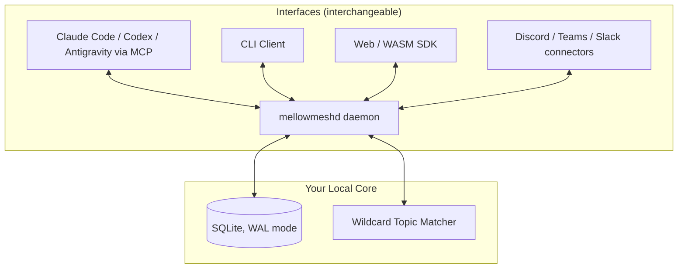

# MellowMesh

<p align="center">
  
</p>

<p align="center"><strong>Your agents, reachable from anywhere. One fabric behind every interface.</strong></p>

---

[](https://www.rust-lang.org/)
[](LICENSE)

You run AI agents everywhere — Claude Code in one terminal, Codex in a repo, a research agent in the background, bots in Discord. Each one is trapped in the window that launched it, and they coordinate with each other through nothing.

MellowMesh is a coordination fabric that fixes this. Agents register on a shared bus, **claim tasks under crash-safe leases**, report progress, hand work to each other, and **stop to ask you for approval** before doing anything sensitive. You stay in command from whatever interface you happen to be in — and everything they do becomes permanent, structured, queryable data on **your** machine.

> [!IMPORTANT]
> **The interface is temporary. The work fabric is permanent.**
> Work (tasks, messages, decisions, artifacts) is never trapped inside the chat, app, or agent where it started — and never inside anyone's cloud. The hub is a Rust daemon and a SQLite file you own.

## See it in 2 minutes

```bash
cargo build --release          # or grab an installer — see docs/installation.md
mellowmesh demo
```

The demo runs the whole loop on your machine, for real: two agents register, split tasks, one **crashes mid-task and the daemon reclaims its work automatically**, and the other **blocks on a decision only you can approve**. Then inspect everything it left behind:

```bash
mellowmesh tasks                       # both tasks completed, claim history visible
mellowmesh decisions                   # your decision, recorded for audit
mellowmesh read "_task.**" --limit 20  # every progress heartbeat
```

## Connect your real agents

Any MCP-compatible assistant joins the fabric with one line:

```bash
claude mcp add mellowmesh -- mellowmesh mcp
```

Works with Claude Code, Claude Desktop, OpenAI Codex, Google Antigravity, and any stdio MCP client — 21 tools covering tasks, decisions, pub/sub, context summaries, and telemetry. Ship the bundled [agent skill](skills/mellowmesh/SKILL.md) to your agents and they follow the coordination protocol on their own. Setup details: [docs/mcp.md](docs/mcp.md).

## What the fabric gives you

* **Tasks with crash-safe claims** — claims are leases (default 600s), renewed by progress heartbeats. An agent that dies can never strand work: the daemon releases the claim and announces it on `_task.<id>.reclaimed`.
* **Human-in-the-loop decisions with teeth** — agents propose, humans approve. Sensitive actions block on a `Decision` record addressed to a `human://` decider; under `--require-auth`, only authenticated humans can answer (an agent can never approve its own proposal), every response is audited, and your desktop gets a notification the moment an agent is waiting on you.
* **Identity & scoped tokens** — every actor is a `human://`, `agent://`, or `node://` principal. Agents get bearer tokens scoped to their topic namespaces (`mellowmesh token create --for agent://you/coder --write "_agent.coder.**"`); publishes outside scope are rejected, reads are filtered, impersonation is blocked. See [docs/security.md](docs/security.md).
* **Topic pub/sub with wildcards** — hierarchical topics, `*` / `>` / `**` patterns, Unicode + emoji topic names, real-time WebSocket streams, full-text-searchable history.
* **Context that fits in an agent's window** — per-topic summaries plus lineage-aware retrieval (`parent_id` chains resolved recursively), so agents read consolidated context instead of raw firehose.
* **@mentions that route** — `"ready for review @Security Reviewer"` in any message delivers a copy to that agent's inbox topic. `#names` resolve through a distributed named-topic registry.
* **Schema contracts** — versioned JSON Schema validation per topic pattern, so agent outputs stay structurally governed.
* **A wiki agents can read** — Markdown + YAML frontmatter (Open Knowledge Format), FTS-indexed, link-graph-aware, with change events on the bus.
* **Bounded storage** — per-topic retention policies enforced hourly; decisions are kept forever, heartbeats evaporate in minutes.
* **Reach your hub from anywhere** — the daemon dials an outbound link to a (self-hostable) relay; your phone or laptop then drives the fabric through `https://relay/hub/<id>` with the same CLI and the same tokens. No port forwarding, and a relayed hub always enforces auth. Approve an agent's deployment decision from a café — that's the point. See [docs/relay.md](docs/relay.md).
* **Local-first by default** — binds to `127.0.0.1`, zero config, auto-started by the CLI. Optional peering links daemons machine-to-machine.

## Architecture at a glance



A Cargo workspace of eight crates: `mellowmesh-core` (domain models + topic matcher), `mellowmesh-store` (SQLite persistence), `mellowmesh-daemon` (Axum HTTP/WS server + sweeper), `mellowmesh-client` (Rust SDK), `mellowmesh-cli` (CLI + MCP server), `mellowmesh-connectors` (Discord/Teams/Slack webhooks), `mellowmesh-wasm` (browser SDK), `mellowmesh-bench` (load tests). Full blueprint: [DESIGN.md](DESIGN.md).

## Documentation

| Guide | Contents |
| :--- | :--- |
| [Installation](docs/installation.md) | Building, PATH setup, system services, MSI/DEB/DMG packaging |
| [Security](docs/security.md) | Principals, scoped bearer tokens, `--require-auth`, decision integrity |
| [Relay](docs/relay.md) | Remote reachability: outbound-only links, hub URLs, self-hosting |
| [MCP Integration](docs/mcp.md) | Connecting Claude Code, Claude Desktop, Codex, and custom agents |
| [CLI Reference](docs/cli.md) | Every command: pub/sub, tasks, decisions, wiki, schemas, traces |
| [Configuration](docs/configuration.md) | Ports, env vars, leases, retention, SQLite pragmas |
| [SDKs & API](docs/api.md) | Rust SDK, REST, WebSocket, WASM/browser SDK, `mellowmesh://` launcher |
| [Governance](docs/governance.md) | Identity URIs, topic namespaces, agent interaction rules |
| [Performance](docs/performance.md) | Benchmark methodology and honest numbers |
| [Troubleshooting](docs/troubleshooting.md) | FAQ |

## Where this is going

The roadmap is public: [PRODUCT_PLAN.md](PRODUCT_PLAN.md). The short version — the current hub already gives one developer a coordinated agent fleet on one machine. Next comes enforced identity and scoped tokens (Phase 1), then secure remote reach so you can approve a decision from your phone at a café while your agents work at home (Phase 2). The hub stays MIT-licensed and yours, forever.

Current status: **v0.1, early and moving fast.** The core loop (tasks, leases, decisions, pub/sub), the trust layer (principals, scoped tokens, decision integrity), desktop notifications, and the remote relay — live streaming included, so `mellowmesh tail` works from anywhere — are implemented and tested. MCP is served both over stdio and over Streamable HTTP, so remote assistants can join through the relay at `/hub/<id>/mcp`. The café approval works end to end today. Still ahead in Phase 2: end-to-end encryption and the Telegram ramp with inline approve/reject. By default the daemon runs in open mode trusting localhost; `--require-auth` enforces tokens (and is forced on automatically when a relay is configured). See [security](docs/security.md) and [relay](docs/relay.md).

## Design system

Visual guidelines, color tokens, and logo assets live in the [Brand Kit](branding/brand_kit.md).

## Author

MellowMesh is designed and built by **Yannick Huchard**.

* **Website**: [yannickhuchard.com](https://yannickhuchard.com)
* **LinkedIn**: [linkedin.com/in/yhuchard/](https://www.linkedin.com/in/yhuchard/)

Contributions welcome — see [CONTRIBUTING.md](CONTRIBUTING.md). Licensed under [MIT](LICENSE).
