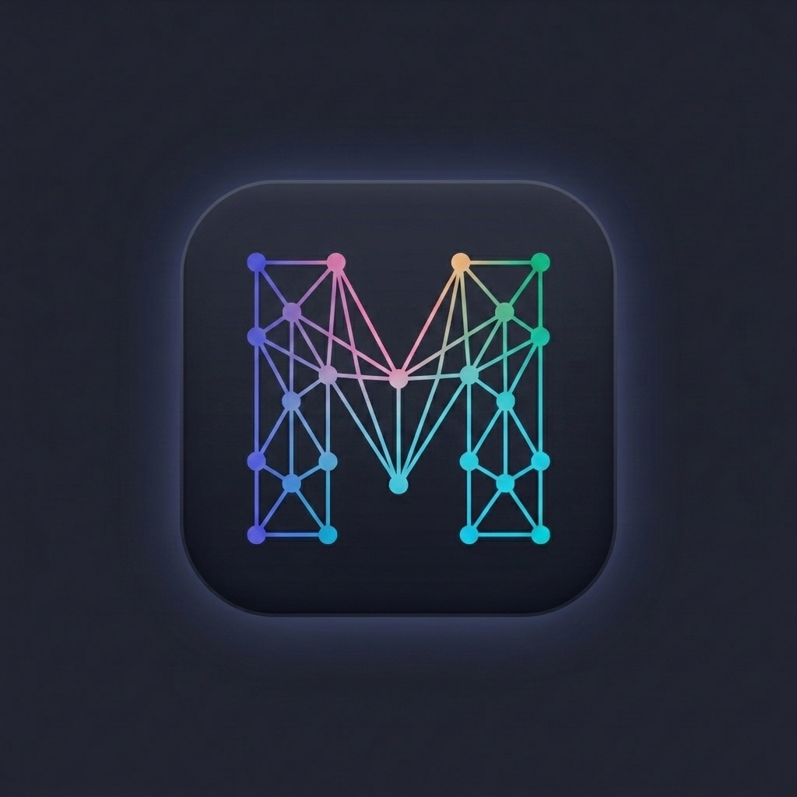
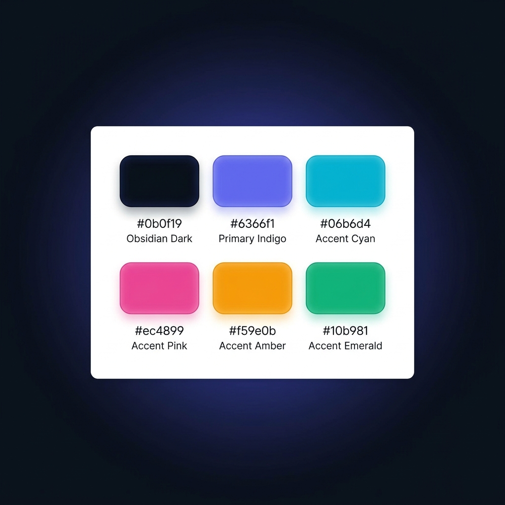

# MellowMesh Brand Kit & Design System

This document outlines the official brand identity, design tokens, and style guidelines for MellowMesh. It serves as a visual and technical reference for creating coherent interfaces, documentation, and promotional materials.

---

## 1. Brand Logo

The MellowMesh logo represents a coordination core—a single, bright node of a decentralized network mesh. It is characterized by a smooth, rounded shape containing a stylized **F** composed of a minimalist, clean network mesh (interconnected nodes and connection lines) and backlit by a soft, multi-colored glow.

### Official Logo Asset


### Logo CSS Implementation
To render the logo symbol in web applications, use the following HTML and CSS:

```html
<div class="logo-container">
    <div class="logo-symbol"></div>
    <h1>MellowMesh</h1>
</div>
```

```css
.logo-container {
    display: flex;
    align-items: center;
    gap: 0.75rem;
}

.logo-symbol {
    width: 32px;
    height: 32px;
    /* Spans Indigo, Cyan, Pink, Amber, and Emerald */
    background: linear-gradient(135deg, #6366f1, #06b6d4, #ec4899, #f59e0b, #10b981);
    border-radius: 8px;
    position: relative;
    overflow: hidden;
    box-shadow: 0 0 15px rgba(99, 102, 241, 0.4), 0 0 25px rgba(6, 182, 212, 0.2);
    animation: pulse-glow 3s infinite alternate;
}

/* Shimmer overlay effect */
.logo-symbol::after {
    content: '';
    position: absolute;
    top: -50%;
    left: -50%;
    width: 200%;
    height: 200%;
    background: linear-gradient(45deg, transparent, rgba(255,255,255,0.1), transparent);
    transform: rotate(45deg);
    animation: logo-shimmer 4s infinite linear;
}

@keyframes logo-shimmer {
    0% { transform: translate(-30%, -30%) rotate(45deg); }
    100% { transform: translate(30%, 30%) rotate(45deg); }
}

@keyframes pulse-glow {
    0% { box-shadow: 0 0 12px rgba(99, 102, 241, 0.3); }
    100% { box-shadow: 0 0 20px rgba(99, 102, 241, 0.6); }
}
```

---

### Official Favicon Assets
A multi-resolution favicon has been compiled directly from the brand logo. It is saved in the repository under:
*   [favicon.ico](./favicon.ico) (includes 16x16, 32x32, and 48x48 sizes)
*   [favicon-32x32.png](./favicon-32x32.png) (32x32 standard web display icon)
*   [favicon-16x16.png](./favicon-16x16.png) (16x16 browser tab icon)

To integrate the favicon in your HTML header, include:
```html
<link rel="icon" type="image/x-icon" href="/branding/favicon.ico">
<link rel="icon" type="image/png" sizes="32x32" href="/branding/favicon-32x32.png">
<link rel="icon" type="image/png" sizes="16x16" href="/branding/favicon-16x16.png">
```

---

## 2. Color Palette

MellowMesh uses a modern, premium dark-mode palette. The primary color scheme utilizes deep obsidian tones accented by high-vibrancy tech neons (Indigo and Cyan), with additional functional status colors.

### Visual Palette Preview


### Design Tokens (CSS Variables)
Copy the following root variables to maintain color consistency across stylesheets:

```css
:root {
    /* Backgrounds */
    --bg-color: #0b0f19;                  /* Obsidian Dark */
    --card-bg: rgba(22, 28, 45, 0.65);    /* Dark Translucent Slate */
    --card-border: rgba(255, 255, 255, 0.08); /* Subtle border for glassmorphism */

    /* Core Brand Accents */
    --primary: #6366f1;                   /* Primary Indigo */
    --primary-hover: #4f46e5;             /* Hover state Indigo */
    --primary-glow: rgba(99, 102, 241, 0.15);
    --accent-cyan: #06b6d4;               /* Secondary Cyan */

    /* Functional Accents (Statuses) */
    --accent-pink: #ec4899;               /* Error / Disconnected */
    --accent-amber: #f59e0b;              /* Warning / Connecting */
    --accent-emerald: #10b981;            /* Success / Active */

    /* Typography & Shadows */
    --text-color: #f3f4f6;                /* Bright White-Gray */
    --text-muted: #9ca3af;                /* Muted Gray */
    --shadow-premium: 0 10px 30px -10px rgba(0, 0, 0, 0.7);
}
```

---

## 3. Typography

MellowMesh emphasizes readability, modern geometric structure, and clear dev-friendly presentation.

*   **Primary Interface Font**: **Outfit** (loaded via Google Fonts)
    *   *Usage*: Headings, navigation, button labels, UI controls.
    *   *Weights*: `300 (Light)`, `400 (Regular)`, `600 (Semi-Bold)`, `800 (Extra-Bold)`.
*   **Data & Terminal Font**: **JetBrains Mono**
    *   *Usage*: CLI output, system tables, code snippets, raw JSON responses.
    *   *Weights*: `400 (Regular)`, `600 (Semi-Bold)`.

### Typography CSS Imports
```css
@import url('https://fonts.googleapis.com/css2?family=JetBrains+Mono:wght@400;600&family=Outfit:wght@300;400;600;800&display=swap');

body {
    font-family: 'Outfit', -apple-system, BlinkMacSystemFont, "Segoe UI", Roboto, sans-serif;
}

code, pre {
    font-family: 'JetBrains Mono', monospace;
}
```

---

## 4. UI Patterns & Aesthetics

To maintain a premium feel across all platforms, interfaces should follow these rules:

1.  **Glassmorphism**: Use translucent card backgrounds with border-outlines and backdrop filters.
    ```css
    .panel {
        background-color: var(--card-bg);
        border: 1px solid var(--card-border);
        backdrop-filter: blur(12px);
        border-radius: 12px;
        box-shadow: var(--shadow-premium);
    }
    ```
2.  **Text Gradients**: Use subtle gradients for major headers to make them stand out.
    ```css
    h1 {
        background: linear-gradient(to right, #ffffff, #a5b4fc);
        -webkit-background-clip: text;
        -webkit-text-fill-color: transparent;
    }
    ```
3.  **Active Indicators**: Status indicators should utilize the functional status variables and include outer glows.
    ```css
    .active-indicator {
        width: 8px;
        height: 8px;
        background-color: var(--accent-emerald);
        border-radius: 50%;
        box-shadow: 0 0 8px var(--accent-emerald);
    }
    ```
